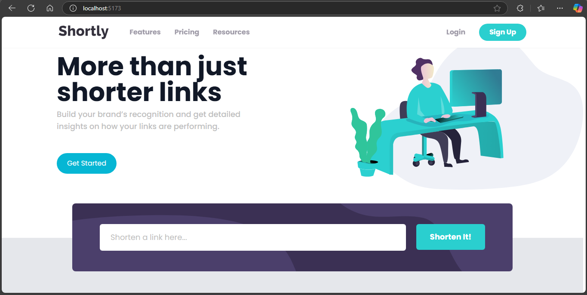

# Shortly - URL Shortening API Landing Page

This is a solution to the [URL shortening API landing page challenge on Frontend Mentor](https://www.frontendmentor.io/challenges/url-shortening-api-landing-page-2ce3ob-G). Frontend Mentor challenges help you improve your coding skills by building realistic projects.

 

## Table of Contents

*   Overview
    *   The Challenge
    *   Links
*   My Process
    *   Built With
    *   Key Features
*   Getting Started
*   Acknowledgements

## Overview

### The Challenge

Users should be able to:

*   View the optimal layout for the site depending on their device's screen size
*   Shorten any valid URL
*   See a list of their shortened links (Note: This part might require backend integration or local storage implementation, which may not be fully built in this frontend-only version)
*   Copy the shortened link to their clipboard in a single click
*   Receive an error message when the form is submitted if:
    *   The input field is empty
    *   The URL is not valid
*   See hover states for all interactive elements on the page
*   View animations for elements loading and interacting.

### Links

*   Solution URL: [Github Link](https://github.com/Dhavisco/URL-Shortener)

## My Process

### Built With

*   **React:** A JavaScript library for building user interfaces.
*   **TypeScript:** Superset of JavaScript adding static type definitions.
*   **Tailwind CSS:** A utility-first CSS framework for rapid UI development.
*   **Framer Motion:** A production-ready motion library for React.
*   **Vite:** Frontend tooling for fast development builds. (Assuming Vite based on `main.tsx` structure)
*   Semantic HTML5 markup
*   CSS Custom Properties (via Tailwind's theme)
*   Flexbox
*   CSS Grid
*   Mobile-first workflow

### Key Features

*   **Responsive Design:** Adapts seamlessly to various screen sizes from mobile to desktop.
*   **URL Shortening Form:** Interactive form with client-side validation for empty input and invalid URL format.
*   **Animated Elements:** Smooth loading and interaction animations implemented using Framer Motion for components like the Hero section, Features cards, and buttons.
*   **Mobile Navigation:** A functional hamburger menu for navigation on smaller screens.
*   **Hover & Focus States:** Clear visual feedback for all interactive elements like links and buttons.
*   **Dynamic Backgrounds:** Uses CSS variables to load different background images for mobile and desktop layouts in certain sections.

## Getting Started

To get a local copy up and running, follow these simple steps.

### Prerequisites

*   Node.js (which includes npm) installed on your machine.

### Installation

1.  **Clone the repository:**
    ```bash
    git clone https://github.com/Dhavisco/URL-Shortener.git
    ```
    *(Replace with your actual repository URL)*
2.  **Navigate to the project directory:**
    ```bash
    cd URL-Shortener
    ```
3.  **Install NPM packages:**
    ```bash
    npm install
    ```
    *(Or `yarn install` if you prefer Yarn)*
4.  **Run the development server:**
    ```bash
    npm run dev
    ```
    *(Or `yarn dev` for Vite; use `npm start` or `yarn start` if using Create React App)*

5.  Open your browser and navigate to `http://localhost:5173` (or the port specified in your console, typically `3000` for Create React App).

## Acknowledgements

*   Challenge provided by Frontend Mentor.
*   Illustrations and design assets provided by Frontend Mentor.

